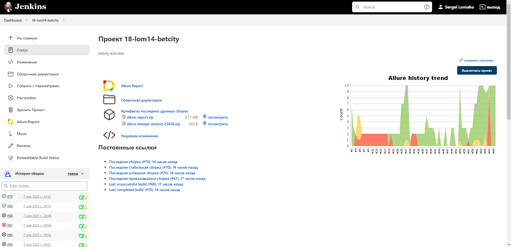
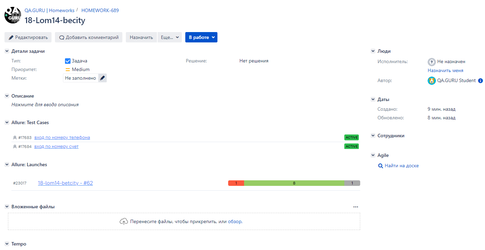

<h1 >Демопроект по автоматизации тестирования сайта <a href="https://betcity.ru/ "> БЕТСИТИ</a></h1>

## ☑️ Содержание:

- Технологии и инструменты
- Список проверок, реализованных в тестах
- Запуск тестов (сборка в Jenkins) и из терминала
- Allure-отчет
- Интеграция с Allure TestOps
- Интеграция с Atlassian Jira
- Уведомление в Telegram о результатах прогона тестов
- Видео пример прохождения тестов


<a id="tools"></a>
## :ballot_box_with_check:Технологии и инструменты:

| Java                                                                                                      | IntelliJ  <br>  Idea                                                                                               | GitHub                                                                                                     | JUnit 5                                                                                                           | Gradle                                                                                                     | Selenide                                                                                                         | Selenoid                                                                                                                  | Allure <br> Report                                                                                                         |  Jenkins                                                                                                        |   Jira                                                                                                              | Telegram                                                                                                            |Allure <br> TestOps                                                                                                          
|:----------------------------------------------------------------------------------------------------------|--------------------------------------------------------------------------------------------------------------------|------------------------------------------------------------------------------------------------------------|-------------------------------------------------------------------------------------------------------------------|------------------------------------------------------------------------------------------------------------|------------------------------------------------------------------------------------------------------------------|---------------------------------------------------------------------------------------------------------------------------|----------------------------------------------------------------------------------------------------------------------------|-----------------------------------------------------------------------------------------------------------------|---------------------------------------------------------------------------------------------------------------------|---------------------------------------------------------------------------------------------------------------------|----------------------------------------------------------------------------------------------------------------------------------:|
| <a href="https://www.java.com/"></a>  | <a href="https://www.jetbrains.com/idea/"></a> | <a href="https://github.com/"></a> | <a href="https://junit.org/junit5/"></a> | <a href="https://gradle.org/"></a> | <a href="https://selenide.org/"></a> | <a href="https://aerokube.com/selenoid/"></a> | <a href="https://github.com/allure-framework"></a> |<a href="https://www.jenkins.io/"></a> | <a href="https://www.atlassian.com/software/jira/"></a> | <a href="https://web.telegram.org/"></a> |<a href="https://qameta.io/"></a> |

<a id="cases"></a>
## :ballot_box_with_check: Реализованные проверки:

- Параметризованный тест смены языка на русский, английский
- Авторизация через номер телефрна и номер счета
- Заключение пари при недостаточном балансе для ставок Simple, System, Exspress
- Cодержания заголовка главной страницы
- Наличия ссылки на телеграмм бот

## </a><a name="Сборка"></a>Сборка в [Jenkins]</a>

<p align="center">  
</a>  
</p>


## :ballot_box_with_check: Параметры сборки в Jenkins:

- browser (браузер, по умолчанию chrome)
- browserVersion (версия браузера, по умолчанию 100.0)
- browserSize (размер окна браузера, по умолчанию 1920x1080)


## Команды для запуска из терминала
___
***Локальный запуск:***
```bash  
gradle clean X5Group_test
```

***Удалённый запуск через Jenkins:***
```bash  
clean X5Group_test
-Dbrowser="${browser}"
-DbrowserVersion="${browserVersion}"
-DbrowserSize="${browserSize}"
-Dremote="${remote}"
```
___
## </a> <a name="Allure"></a>Allure [отчет](https://jenkins.autotests.cloud/job/Kod3ik_qa_guru_x5/8/allure/)</a>
___

### *Основная страница отчёта*

<p align="center">  
  
</p>  

### *Тест-кейсы*

<p align="center">  
  
</p>

### *Графики*

  <p align="center">  
  
  
</p>

___

## </a>Интеграция с <a target="_blank" href="https://allure.autotests.cloud/project/2197/dashboards">Allure TestOps</a>
____
### *Allure TestOps Dashboard*

<p align="center">  
  
</p>  

### *Ручные тест-кейсы*

<p align="center">  
  
</p>

### *Авто тест-кейсы*

<p align="center">  
  
</p>

___

## </a> Интеграция с <a target="_blank" href="https://jira.autotests.cloud/browse/HOMEWORK-682">Jira</a>
____
<p align="center">  
  
</p>

____
## </a> Уведомление в Telegram при помощи бота
____
<p align="center">  
  
</p>

____
## </a> Примеры видео выполнения тестов на Selenoid
____
<p align="center">
   
</p>

